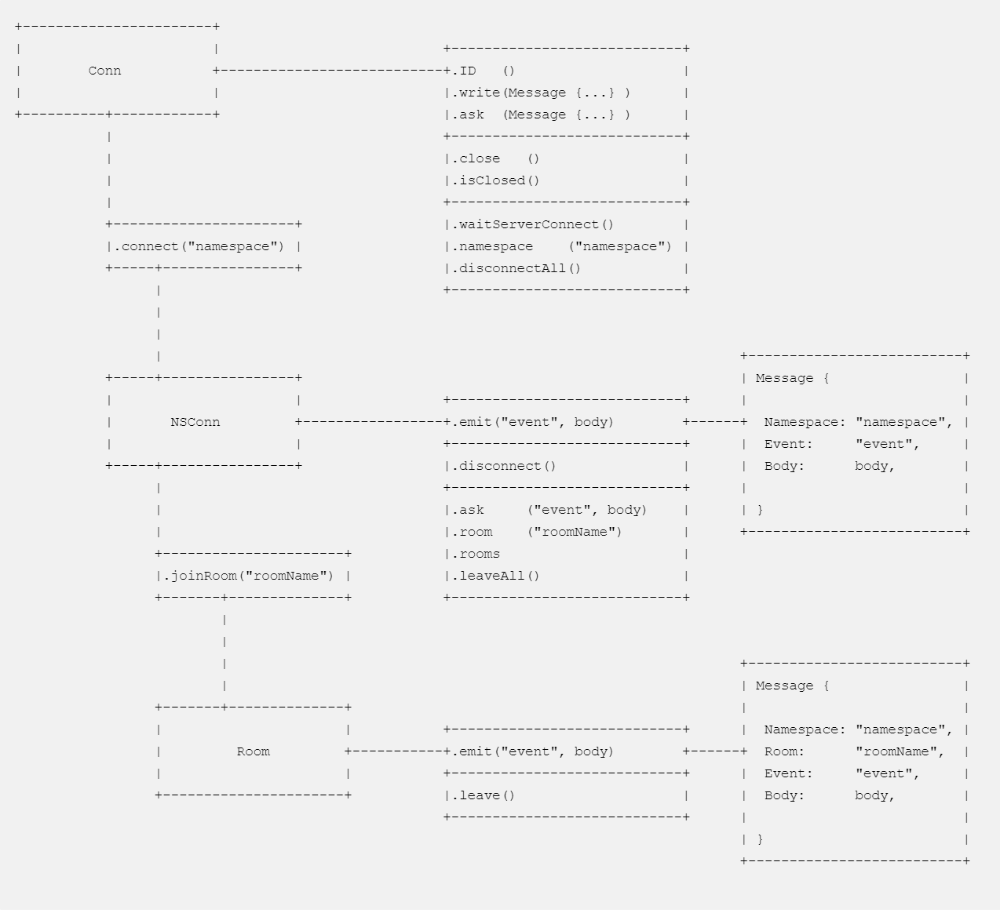

`neffos.js` is the client-side javascript library for the [neffos](https://github.com/kataras/neffos) real-time framework.

It can run through any modern [browser](_examples/browser), [browserify](_examples/browserify) and [nodejs](_examples/nodejs).

[](https://www.npmjs.com/package/neffos.js) [](https://github.com/dwyl/goodparts) [](https://snyk.io/test/github/kataras/neffos.js?targetFile=package.json) [](https://gitter.im/neffos-framework/community) [](https://github.com/kataras/neffos)

## Installation

### node.js

```sh
$ npm install --save neffos.js
```

```js
const neffos = require('neffos.js');
```

### Browsers

Development:

```html
<script src="//cdn.jsdelivr.net/npm/neffos.js@X.X.X/dist/neffos.js"></script>
```

Production:

```html
<script src="//cdn.jsdelivr.net/npm/neffos.js@X.X.X/dist/neffos.min.js"></script>
```

**Remember** to replace the version tag with the exact release your project depends upon.

The library supports CommonJS loader and also exports globally as `neffos`.

## Install Definition File

The definition file for javascript developers is part of the [DefinitelyTyped](https://www.npmjs.com/package/@types/neffos.js). 

```sh
$ npm i @types/neffos.js
```

This libray is written in [Typescript](https://www.typescriptlang.org/) and the [types/index.d.ts](./types/index.d.ts) definition file is part of the `npm install`. The library offers full documentation of all of its exported methods. Tools like [VS Code](https://code.visualstudio.com/) supports syntax highlighting and autocompletion while typing. The definition file can be very helpful mostly for Pure JavaScript developers.

## Documentation

**Navigate** through [./_examples](_examples) for basic usage, and [kataras/neffos/_examples](https://github.com/kataras/neffos/tree/master/_examples) for extensive use.

[](ascii_outline.txt)

## Versioning

[](https://www.npmjs.com/package/neffos.js)

Read more about Semantic Versioning 2.0.0

 - http://semver.org/
 - https://en.wikipedia.org/wiki/Software_versioning
 - https://wiki.debian.org/UpstreamGuide#Releases_and_Versions